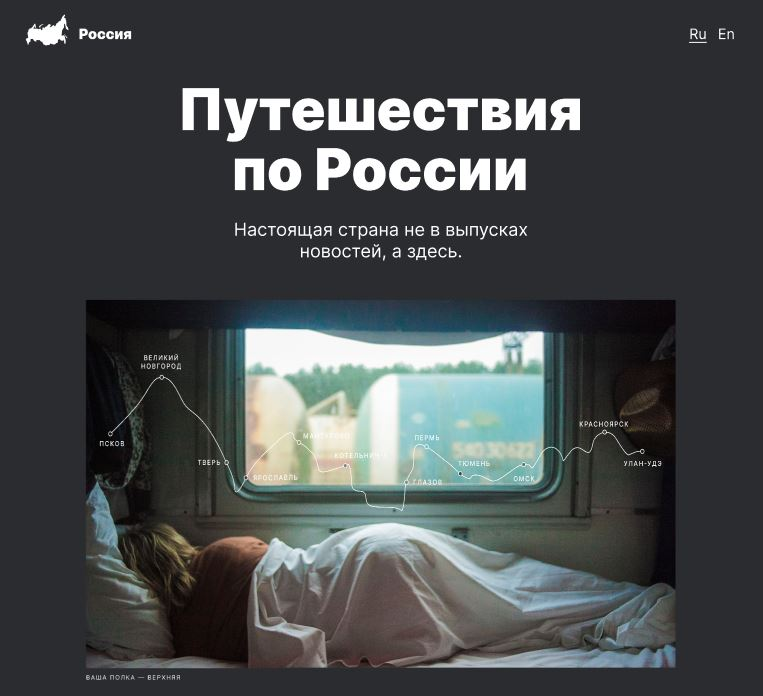

# Проект: Путешествия по России

## [Демонстрация сайта]()



## ***Содержание:***
- [Описание проекта](#Description)
- [Используемые технологии](#Technologies)
- [Структура каталога проекта](#ProjectStructure)
- [Оценка качества кода](#Quality)
- [Планы по доработке проекта](#Planes)


# Описание проекта <a name="Description"></a>

**Путешествия по России** — второй самостоятельный проект в рамках обучения на курсе "Web-разработчик" в Яндекс Практикум. В рамках обучения для выполнения проектной работы был предоставлен макет в программе [Figma](https://www.figma.com/file/5S2WSbEFL6awjVWJ0NWL8Q/Sprint-3_-Russia-_-desktop-%2B-mobile?node-id=28503%3A0&t=ppSUaHh7yQCqrjcP-0), по которому нужно было сверствать сайт.
Проект о путешествиях по России должен корректно отображаться на экранах популярных размеров (1280px, 1024px, 768pz, 320px).


# Используемые технологии <a name="Technologies"></a>

1. Проект реализован с помощью языка разметки HTML5.

2. За описание внешнего вида сайта отвечает язык каскадных таблиц стилей CSS.

3. Все элементы страницы и стили реализованы в соответствии с концепцией [БЭМ](https://ru.bem.info/methodology/quick-start/).

4. При размещении элементов на странице использовалась технология для создания сложных гибких макетов [CSS Flexbox](https://doka.guide/css/flexbox-guide/) и технология [CSS Grid Layout](https://doka.guide/css/flexbox-guide/), которая предлагает систему компоновки на основе сетки со строками и столбцами.

5. Все ссылки на странице имеют состояние наведении мыши и в блоке "До байкала "на собаках" при наведении мыши происходит затемнение подложки с эффектом анимации. Этот эффект реализован с использованием [псевдоклассов](https://doka.guide/css/pseudoclasses/) и свойства [CSS Transition](https://doka.guide/css/transition/). Подложка создана с помощью псевдоэлемента [::before](https://doka.guide/css/before/) без дополнительной HTML-разметки.

7. Изменение внешнего вида элемнтов для корректного отображения на устройствах разного типа реализовано с помощью директив CSS - [медиазапросов](https://doka.guide/css/media/).

# Структура каталога проекта <a name="ProjectStructure"></a>

```
📦russian-travel
 ┣ 📂blocks
 ┃ ┣ 📂cover
 ┃ ┃ ┣ 📂__overlay
 ┃ ┃ ┃ ┗ 📜cover__overlay.css
 ┃ ┃ ┣ 📂__subtitle
 ┃ ┣ 📂footer
 ┃ ┣ 📂header
 ┃ ┣ 📂intro
 ┃ ┣ 📂lead
 ┃ ┣ 📂one-column
 ┃ ┣ 📂page
 ┃ ┣ 📂photo-grid
 ┃ ┣ 📂place
 ┃ ┗ 📂places
 ┣ 📂fonts
 ┃ ┣ 📜Inter-Black.woff
 ┃ ┗ 📜Inter-Black.woff2
 ┣ 📂images
 ┣ 📂pages
 ┃ ┗ 📜index.css
 ┣ 📂vendor
 ┃ ┣ 📜fonts.css
 ┃ ┗ 📜normalize.css
 ┣ 📜.editorconfig
 ┣ 📜.nojekyll
 ┣ 📜index.html
 ┗ 📜README.md

📜.editorconfig - Файл настроек форматирования кода
📜.nojekyll     - Пустой файл, нужен для корректной публикации в GitHub Pages
📜index.html    - Главная страница сайта
📜README.md     - Файл документации проекта
📂blocks        - Каталог, содержащий CSS стили согласно концепции Nested BEM
📂images        - Каталог, содержащие изображения
📂pages         - Каталог в котором подключаются CSS стили, необходимые конкретной странице
📂vendor        - Каталог с 3rd-party зависимостями
```
# Оценка качества кода <a name="Quality"></a>
Качество кода обусловлено его проверкой по чек-листу Яндекс Практикума, автоматическими проверками и код-ревью специалистом Яндекс Практикума.

Для преварительной прверки использованы валидаторы
- [Markup Validation Service](https://validator.w3.org/#validate_by_uri)
- [Генератор HTML-дерева](https://yoksel.github.io/html-tree/)

# Планы по доработке проекта <a name="Planes"></a>
- Создать backend-приложение для поддержки локализации после изучения JavaScript.

